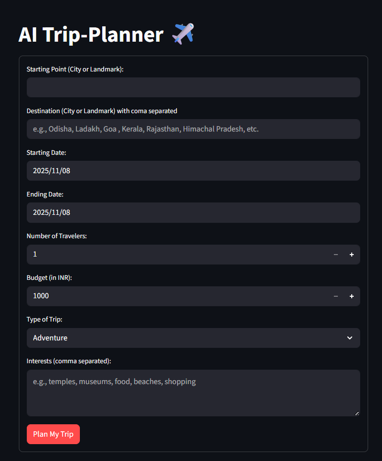

🧠 AI Trip Planner

An intelligent travel planning web application built with Python, Streamlit, and Google Gemini API.
It helps users create personalized travel itineraries based on their preferences — destinations, budget, duration, and interests.

---

🚀 Features

· 🗺️ AI-Powered Recommendations — Uses Google Gemini to suggest destinations, activities, and hotels
· 📅 Smart Itinerary Generation — Creates a full travel plan with day-wise scheduling
· 💰 Budget Optimization — Suggests affordable or luxury options based on your budget range
· 🌤️ Weather Insights — Provides climate information for your travel dates
· 🧳 Custom Filters — Choose interests like adventure, relaxation, culture, food, etc.
· ⚡ Instant Results — Built with Streamlit for a fast and interactive experience

---

🧩 Tech Stack

Component Technology
Frontend/UI Streamlit
Backend Python
AI Model Google Gemini API
Environment Management Virtualenv / Conda
Deployment Streamlit Cloud

---

🏗️ Project Structure

```
ai-trip-planner/
│
├── app.py                 # Main Streamlit application
├── requirements.txt       # Python dependencies
├── .env                  # Environment variables (API keys)
├── utils/
│   ├── gemini_api.py     # Functions to call Gemini API
│   ├── itinerary_builder.py # Logic to generate trip plans
│   └── helpers.py        # Additional utilities
├── assets/
│   └── images/           # Optional images and icons
└── README.md             # Project documentation
```

---

🔑 Setup Instructions

1️⃣ Clone the Repository

```bash
git clone https://github.com/ruturaj45/Ai_Trip_Planner.git
cd Ai_Trip_Planner
```

2️⃣ Create a Virtual Environment

```bash
# Windows
python -m venv my_env
my_env\Scripts\activate

# Mac/Linux
python -m venv my_env
source my_env/bin/activate
```

3️⃣ Install Dependencies

```bash
pip install -r requirements.txt
```

4️⃣ Configure API Keys

Create a .env file in the project root and add your Gemini API key:

```env
GEMINI_API_KEY=your_gemini_api_key_here
```

5️⃣ Run the Application

```bash
streamlit run app.py
```

---

💡 How to Use

1. Enter your travel details - destination, budget, and number of days
2. Select your interests - choose from adventure, nature, history, food, etc.
3. Generate your plan - click "Generate Trip Plan" to create your itinerary
4. View recommendations - explore suggested places, hotels, and activities

---

🧠 Powered By

· Streamlit - Web application framework
· Google Gemini API - AI-powered recommendations
· Python 3.10+ - Backend logic and processing

---

📸 Demo



---

📄 License

This project is open source and available under the MIT License.

---

🤝 Contributing

Contributions, issues, and feature requests are welcome! Feel free to check the issues page.

---

Start planning your perfect trip with AI! ✈️🌍
